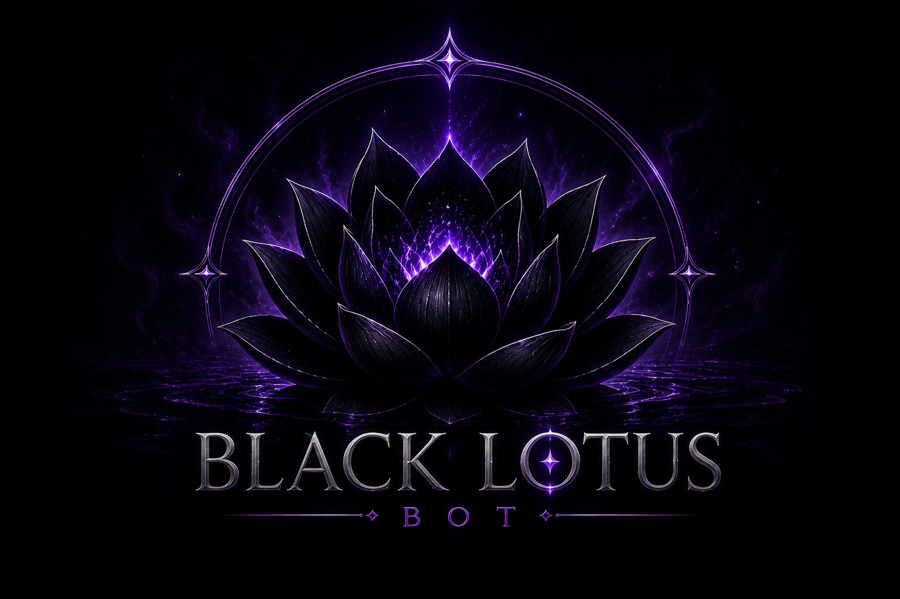

<div align="center">

</div>

<div align="center">
  
  
  <br/>

  

  <br/>

  [](https://wa.me/5511986059638)
  [](https://github.com/Sr-agente208/Botzin1)
  [](https://nodejs.org)
  [](https://github.com/WhiskeySockets/Baileys)

  <br/>

  
  

</div>

---

<div align="center">

```
╔══════════════════════════════════════════════════════════════╗
║                                                              ║
║   🪷  B L A C K   L O T U S   B O T  🪷                    ║
║                                                              ║
║   "Como a lótus negra que emerge das águas escuras,          ║
║    este bot nasceu para dominar grupos com poder,            ║
║    elegância e precisão absoluta."                           ║
║                                                              ║
╚══════════════════════════════════════════════════════════════╝
```

</div>

---

## 🌑 Visão Geral

<div align="center">

| 🔥 Rápido | 🛡️ Seguro | ⚡ Estável | 🎨 Elegante |
|:---------:|:---------:|:----------:|:-----------:|
| Respostas instantâneas | Sistema de ADM | Online 24/7 | Design Único |

</div>

<br/>

```javascript
// 🪷 Black Lotus Bot — Nascido nas sombras, feito para dominar.
const BlackLotus = {
  nome:     "Black Lotus Bot",
  criador:  "Sr.Agente208",
  contato:  "5511986059638",
  prefixo:  "™",
  versao:   "2.5.0 (Final Fix)",
  status:   "🟢 Online & Corrigido"
}
```

---

## ✨ Novos Recursos (v2.5)

<div align="center">

| Recurso | Comando | Descrição |
|:-------:|:-------:|-----------|
| 🧠 **Deep Search** | `™deepsearch` | Inteligência Artificial avançada para pesquisas complexas. |
| 📦 **Sticker Packs** | `™pack [tema]` | Busca e baixa pacotes completos do Sticker.ly automaticamente. |
| 🎨 **Custom Packs** | `™criarpack` | Inicia a criação de um pacote personalizado com suas fotos. |
| ✅ **Finalizer** | `™finalizarpack` | Converte e envia seu pacote personalizado de uma só vez. |

</div>

---

## 🚀 Instalação & Start

Siga os passos abaixo para ter o **Black Lotus** rodando em segundos:

### 1️⃣ Preparação do Ambiente
Certifique-se de ter o **Node.js 18 ou superior** instalado.

### 2️⃣ Clonagem e Dependências
```bash
# Clone o repositório
git clone https://github.com/Sr-agente208/Botzin1.git

# Entre na pasta
cd Botzin1

# Instale todas as dependências (Correção de erros inclusa)
npm install
```

### 3️⃣ Configuração Rápida
Edite o arquivo `./dono/dono.json` com seus dados:
```json
{
    "NumberDono": "SEU_NUMERO",
    "prefix": "™",
    "NickDono": "SEU_NICK",
    "NomeBot": "Black_Lotus"
}
```

### 4️⃣ Iniciar o Bot
```bash
# Inicie o sistema
npm start
```
*Escaneie o QR Code que aparecerá no terminal ou no link do servidor local (porta 3000).*

---

## ☁️ Deploy no Railway

O Black Lotus já vem configurado para o **Railway**!

1. Conecte seu GitHub ao Railway.
2. Selecione este repositório.
3. O Railway detectará o `nixpacks.toml` e fará o deploy automático.
4. **Importante:** Após o primeiro login, o bot salvará a sessão. Para manter online, você pode usar o QR Code via URL pública gerada pelo Railway.

---

## 📞 Contato & Suporte

<div align="center">

**👤 Desenvolvedor: Sr.Agente208**

[](https://wa.me/5511986059638)

*📲 Suporte • Aluguel • Personalização de Scripts*

</div>

---

<div align="center">


**🪷 BLACK LOTUS BOT © 2026 — Sr.Agente208 🪷**

*Poder nas Sombras • Elegância na Luz • Domínio nos Grupos*

</div>
