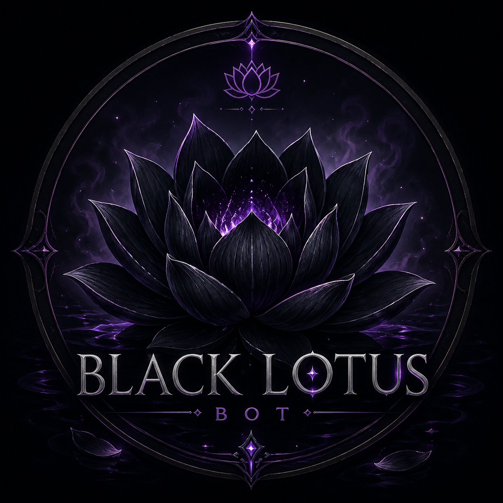

<div align="center">



# 🪷 BLACK LOTUS BOT 🪷
### *O bot que floresceu nas sombras*

[](https://wa.me/5511986059638)
[](https://github.com/Sr-agente208/Botzin1)
[](https://nodejs.org)

</div>

---

## 🌑 Sobre o Black Lotus

> *"Como a lótus negra que emerge das águas escuras, este bot nasceu para dominar grupos com poder, elegância e precisão."*

O **Black Lotus Bot** é um bot de WhatsApp completo, desenvolvido com a biblioteca **Baileys**, repleto de comandos exclusivos para gerenciamento de grupos, diversão e utilidades. Rápido, otimizado e sempre online.

---

## ✨ Recursos Principais

```
🛡️  Proteção total de grupos    →  antilink, antiimg, antivideo e mais
👋  Boas-vindas automáticas     →  mensagens e fotos personalizadas  
🎮  Modo brincadeira            →  abraço, shippo, bruxo e outros
🎵  Música do YouTube           →  baixe áudios direto no grupo
🖼️  Criador de figurinhas       →  converta imagens e vídeos
📅  Utilitários                 →  clima, calculadora, calendário
⚙️  Administração               →  ban, promote, marcar, limpar
🔐  Sistema de senha            →  proteção contra uso indevido
```

---

## 🚀 Como Usar

### Pré-requisitos
- Node.js 18+
- Git

### Instalação

```bash
# Clone o repositório
git clone https://github.com/Sr-agente208/Botzin1.git

# Entre na pasta
cd Botzin1

# Instale as dependências
npm install

# Inicie o bot
node index.js
```

### Vinculação
Ao iniciar pela primeira vez, digite seu número com DDI e aguarde o **código de vinculação** aparecer no terminal. Insira o código no WhatsApp em:

> **WhatsApp → Aparelhos conectados → Conectar aparelho → Código de 8 dígitos**

---

## 📋 Comandos

| Categoria | Comando | Descrição |
|-----------|---------|-----------|
| 📋 Geral | `™menu` | Abre o menu principal |
| 📋 Geral | `™ping` | Verifica velocidade do bot |
| 📋 Geral | `™s` | Cria figurinha |
| 🛡️ Grupo | `™antilink 1` | Ativa anti-link |
| 🛡️ Grupo | `™ban @user` | Remove membro |
| 🛡️ Grupo | `™marcar` | Marca todos |
| 🛡️ Grupo | `™limpar` | Limpa o chat |
| 🎮 Fun | `™abraço @` | Dá um abraço |
| 🎮 Fun | `™bruxo @` | Lança maldição |
| 🎮 Fun | `™shippo @` | Mede compatibilidade |
| 🎵 Música | `™play nome` | Baixa música |

> Use `™menu` no grupo para ver todos os comandos disponíveis.

---

## ⚙️ Configuração

Edite o arquivo `./arquivo/settings/setting.json`:

```json
{
  "nomeBot": "Black Lotus",
  "NickDono": "Sr.Agente208",
  "numero": "5511986059638",
  "prefix": "™",
  "jpgBot": "URL_DA_SUA_IMAGEM"
}
```

---

## 🌐 Deploy no Railway

1. Faça fork/clone deste repositório
2. Gere a sessão **localmente** com `node index.js`
3. Faça commit da pasta `conexão` gerada
4. Conecte o repositório ao Railway
5. O bot vai subir automaticamente

---

## 📞 Contato & Suporte

<div align="center">

**Desenvolvido por Sr.Agente208**

[](https://wa.me/5511986059638)

*Entre em contato para suporte, sugestões ou aluguel do bot.*

</div>

---

## ⚠️ Avisos

- Este bot é para uso **educacional e pessoal**
- Não nos responsabilizamos pelo uso indevido
- Respeite os **Termos de Serviço** do WhatsApp
- Não use para spam ou atividades ilegais

---

<div align="center">

🪷 **BLACK LOTUS BOT** — *Poder nas sombras, elegância na luz* 🪷

</div>
